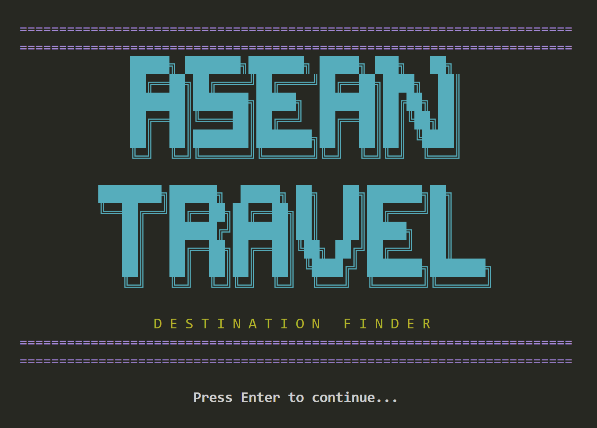
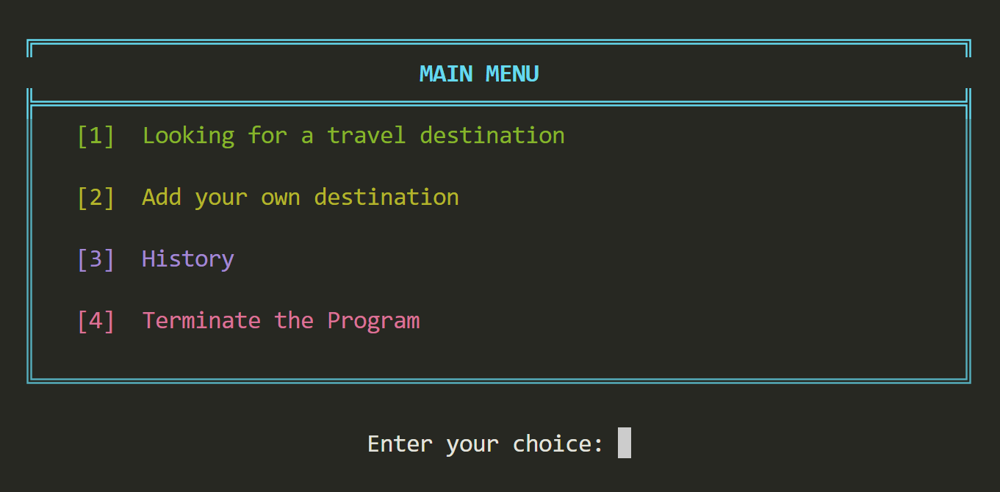

# ✈️🪭ASEAN Travel Destination Finder
## Description
When planning a vacation/travel, there are several key factors to consider. This includes budgeting, researching, booking, and extensive planning. Just the general overwhelm of decision-making would cause a lot of stress for the travellers. To mitigate this stress, we have come up with the project entitled: **“ASEAN Travel Destination Finder”**

The main target users of this application are the travellers, as this will help them to find ASEAN countries/destinations to explore by just providing input of basic information such as their budget and travel interests, then the application will suggest destinations that match their given inputs. 

Using the program, the travellers will not be too indulged in so much time researching for the perfect travel destinations that would suit their personal preferences; instead, the program will help them save time as it provides algorithm-based recommendations. The program also supports budget planning as it filters destinations by overall cost, which would help travellers find budget-friendly destinations to luxurious destinations that may suit their budget.

The console application has its 3 main features, which are: (1) Suggests SEA travel destinations based on users’ budget and interest, (2) Enables adding users’ own destinations, and (3) Enables viewing of history.
## OOP Concepts Applied
### 1. Abstraction
***Abstract class***, by definition, is a class that cannot be instantiated but serves as a base class for other classes. Moreover, it can contain both regular, implemented methods and abstract methods, which are declared without an implementation and must be defined by the subclass (MATLAB, 2025).  

In the project, the `Destination` class was defined. It is an abstract class that contains common properties, namely: `name`, `country`, `budget`, and `type`.  

The class defined 4 abstract methods, such as:  
* `getDescription()`: String - [description]
* `getCulturalInfo()`: String
* `getClimateInfo()`: String 
* `getCuisineInfo()`: String

These methods were defined by the class’ **subclasses**, which, according to Gillis (2023), allows for the creation of class hierarchies that define common structures and behaviours while enforcing unique implementations for specific subclasses. 

### 2. Encapsulation
***Encapsulation***, by its definition, is a fundamental concept in OOP that bundles data (attributes) and the methods (functions) that operate on that data into a single unit called a class (Janssen, 2024). Moreover, it acts as a protective barrier, hiding the internal state of an object from outside access and ensuring the data is only modified through the object's own methods (often called “**getters**” and “**setters**”), which promotes data integrity, security, and modularity.

This principle became very useful in developing this project as it tackles variables that have multiple attributes or properties, such as: **SEA countries**, **travel destinations**, and as well as the **users**.

### SEA Countries
The project defined a class, namely `Country`, that has 3 attributes, including:   
* `name`:  String - The name of the SEA country 
* `greeting`: String - The country’s national greeting
* `destinations`: List<Destination> - Pre-defined travel destinations

This class defines many functions, mostly **getters**, including:  
* `getName()`: String - Returns the name of the country
* `getGreeting()`: String - Returns the national greeting of the particular country
* `getDestinations()`: List<Destination> - Returns the travel destination
### Travel Destinations
The project defined a class, namely `Destination`, that has 4 attributes, including:  
* `name`:  String - The name of the destination
* `country`: String - The name of the country/location
* `budget`: double - The budget required
* `type`: String - The type of place 

This class defines many functions, all **getters**, including:  
* `getName()`: String - Returns the name 
* `getCountry()`: String - Returns the country
* `getBudget()`: double - Returns the budget
* `getType()`: String - Returns the type  
### User
The project defined a class, namely `UserSession`, that has 4 attributes, including:  
* `userName`:  String - The name of the user
* `nationality`: String - Their nationality
* `searchHistory`:  List<String> - The search history
* `receipts`:  List<String> - The receipts
  
This class defines many functions, mostly **getters** and **setters**, including:  
**Getters:**
* `getUserName()`: String - Returns the name 
* `getNationality()`: String - Returns the country
* `getSearchHistory()`: List<String>- Returns the budget
* `getReceipts()`: List<String> - Returns the type
  
**Setters:**  
* `setUserInfo()`: - Sets the value for userName and nationality

As mentioned earlier, **getters** and **setters** are used to ensure data integrity, security, and modularity. But aside from those, using these methods also improved the project’s flexibility, as the data can be changed in the future, which will not affect other parts of the code that use the public getter and setter methods.
### 3. Inheritance
***Inheritance***, by the definition of Janssen (2025), is one of the core OOP concepts where a class (child/derived) can acquire the properties and methods of another class (parent/base). 

As previously stated, `Destination` is an abstract class that defines 4 abstract methods. And this particular class has 3 **sub-classes**, namely: `NatureDestination`, `BeachDestination`, and `UserDestination`. Therefore, the properties and the behaviours the **parent class** contains, in this case the `Destination` class, were inherited by its 3 **child classes**. 

Implementing inheritance in this project promoted code reusability, allowed for the creation of a class hierarchy, and enabled the code to be more modular and scalable. The child classes were then added to their own specific attributes and overrode (override) the inherited methods.

### 4. Polymorphism
***Polymorphism*** is a core concept in object-oriented programming (OOP) that means "many forms." This allows objects to respond to the same message or method call in their own unique way, which makes code more flexible, reusable, and maintainable (BillWagner, n.d.).

In the context of this project, once again, the abstract class `Destination` was the one to apply this concept. This particular class provides common **superclasses** that its **subclasses inherit**, allowing objects of different subclasses to be treated as objects of the abstract type. This enables a single method call to **behave differently** depending on the actual subclass object, which is the core principle of polymorphism.
## Program Structure
### ***Class Relationship***

| Class | Type | Extends | OOP Principle |
| :---- | :--- | :-----: | :-----------: | 
Main | Concrete | | Entry Point |
Destination | Abstract | | Abstraction |
NatureDestination | Concrete | Destination | Inheritance |
BeachDestination | Concrete | Destination |  Inheritance |
UserDestination | Concrete | Destination | Inheritance |
Country | Concrete | | Encapsulation |
UserSession | Concrete | | Encapsulation |
TravelApp | Concrete | | Polymorphism |
DestinationManager | Concrete | | Polymorphism |
## How to Run the Program
### ***Prerequisites***
1. Before running the program, ensure you have:
  * Java Development Kit (JDK) 8 or higher installed on your system
* Command Line/Terminal access
* All project files properly organized in the correct folder structure
### ***Verify Java Installation***
1. Open your terminal/command prompt and check if Java is installed:  

java -version 
javac -version
* You should see the Java version displayed. If not, download and install JDK from Oracle's website.
### ***Step-by-Step Instructions***
**1. Navigate to Project Directory** Open your terminal/command prompt and navigate to the project folder: 
* **Windows:** cd C:\path\to\ASEANTravelProject  
* **Mac/Linux:** cd /path/to/ASEANTravelProject  
	
**2. Verify Folder Structure** Ensure your project has the following structure:  
 
ASEANTravelProject/  
├── Main.java  
├── models/  
│   ├── Destination.java  
│   ├── NatureDestination.java  
│   ├── BeachDestination.java  
│   └── UserDestination.java  
├── data/  
│   ├── Country.java  
│   └── UserSession.java  
├── app/  
│   └── TravelApp.java  
└── utils/  
  	  └── DestinationManager.java  
 
**3. Compile All Java Files** Compile all the Java source files in one command: 
* **Windows:** javac Main.java models\*.java data\*.java app\*.java utils\*.java
* **Mac/Linux:** javac Main.java models/*.java data/*.java app/*.java utils/*.java

***What happens:*** *This command compiles all .java files and generates .class files in the same directories.*  
***Expected Output:*** *If successful, you'll see no error messages and .class files will be created.*

**4. Run the Program** After successful compilation, run the program:  

java Main  
 
***Expected Output:*** *The program will start and display the welcome banner with the ASEAN Travel Destination Finder logo.*
## Sample Output
#### Project Logo

#### Main Menu

## Author and Acknowledgement
**Olivar, John Rafael** - [contribution/role] - Jrozy71 - 24-07295@g.batstate-u.edu.ph

**Patolot, Reigndel Chryster** - [contribution/role] - reigndel08 - 24-00949@g.batstate-u.edu.ph

**Ramos, Kalin Marie Faye** - [contribution/role] - kalinramos - 24-00116@g.batstate-u.edu.ph

## References
[BillWagner. (n.d.). Polymorphism - C#. Microsoft Learn.](https://learn.microsoft.com/en-us/dotnet/csharp/fundamentals/object-oriented/polymorphism)  
[Braunschweig, D. (2018, December 15). Encapsulation. Programming Fundamentals.](https://press.rebus.community/programmingfundamentals/chapter/encapsulation/#:~:text=Encapsulation%20is%20a%20fundamental%20principle%20of%20object%2Doriented,is%20not%20modified%20unexpectedly%20by%20external%20code**)  
[Janssen, T. (2024, August 27). Encapsulation in Programming: A Beginner’s Guide. Stackify.](https://stackify.com/oop-concept-for-beginners-what-is-encapsulation)  
[Janssen, T. (2025, February 6). OOP concept for beginners: What is inheritance? Stackify.](https://stackify.com/oop-concept-inheritance/)  
[Gillis, A. S. (2023, February 22). abstract class. TheServerSide.com.](https://www.theserverside.com/definition/abstract-class)  

